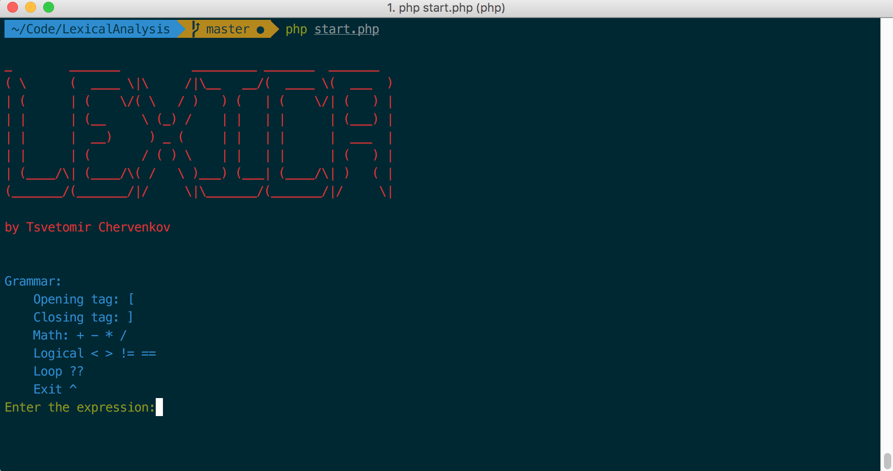
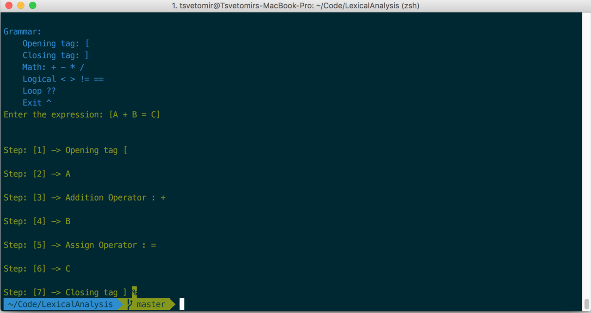
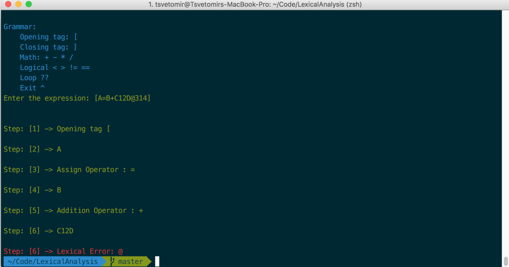

# Dummy Lexical Analyzer

##### This is code for an exam.  

#### Examples:
    php start.php 
   
   write some expression
   
Green: 

[A + B = C]
[A<B+36!=A335BC]
[A=B??(A)]

Fail: 

[A=B+C12D*314??(A33)]

[A=B+C12D@314]

#### Rules:
- Always begin with opening tag [ and finish with closing tag ].
- Use only the proper grammar:
- Grammar:
    - Opening tag: [
    - Closing tag: ]
    - Math: + - * /
    - Logical < > != ==
    - Loop ?? ( ) (*) you can use ( and ) after the loop operator, with identifier after the opening bracket.
    - Exit ^
    
    
    TODO: 
    - Abstract most of the analyze in classes.
    - Add rules before and after logical and math operators.
    
#### Screenshots:

